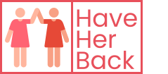

## Inspiration
Thirty years ago, there were approximately 4 million women-owned businesses in
the United States. Today, there are more than 11 million women-owned businesses –
representing 39 percent of all firms.While this trend is moving in the right direction, women-owned businesses still
grow at a slower rate and earn less revenue than male-owned firms. In fact, women
entrepreneurs face persistent institutional barriers that make achieving financial parity
a serious challenge with lasting consequences. The consequences female entreprenuers face on a day-to-day basis inspired us to develop a mentorship and collaboration platform for women.

## What it does

###### Mobile App
* allows opportunities for female entrepreneurs running Small& Medium Enterprises (SMEs) to connect & receive mentorship from industry experts on the platform.  
* SMEs can also seek collaboration amongst themselves by connecting with firms that can cater to their needs. 
* Provision of a collection of relevant news/announcements about special funding/support for women-run SMEs from the internet

###### Website
* Advertises Mobile App

## How we built it
###### Mobile App
* [Maps JavaScript API](https://developers.google.com/maps/documentation/javascript/tutorial) - Used For Embedded Interactive Google Maps and Auto-fill feature for the address slot in the form
* [Geocoding API](https://developers.google.com/maps/documentation/geocoding/start) - Used For Embedded Interactive Google Maps and Auto-Fill feature for the address slot in the form
* [Places API](https://developers.google.com/places/web-service/intro) - Used For Embedded Interactive Google Maps and Auto-Fill Feature for the address slot in the form
* [Figma](https://www.figma.com/file/4fQBl5rxZOUW2aWnzj5W0J/Be-My-Eye?node-id=0%3A1)  - Used to create prototype 
* [Android Studio]() - Used to Develop Flutter App
* [Flutter]() - Used to Develop Flutter App
* [Coding Languages]() - Dart, Ruby,Swift

###### Website
* [Coding Languages]() - HTML,CSS,Bootstrap,JavaScript

## Challenges we ran into
ouch lots of  challenges

## Accomplishments that we are proud of
* Utilizing the knowledge we gained from the workshops to create our application
* Being able to work together and produce something despite our major time zone differences and limited time.
* Being able to bring all of our unique educational backgrounds to produce a product.
* Learning that this is a novel idea that others have not created before.

## What we learned

We learned how to use Flutter for the first time, and how to work together with different skill sets. In addition, we learned that many tools and libraries like |blah,blah,blah| exist that can be used to make our app a reality.

## What's next for Have Her Back

In the future, we are hoping to implement more tools to foster a sense of unity and empowerement. For example, we may include channels were users can discuss day-to-day events and provide each other with resources. We may also insert a channel that allows users to report sexual harassment and other major issues women deal with. Each time a women reports an event a marker is added to the location where the event occurred. The marker can have different colors to signify different issues.
